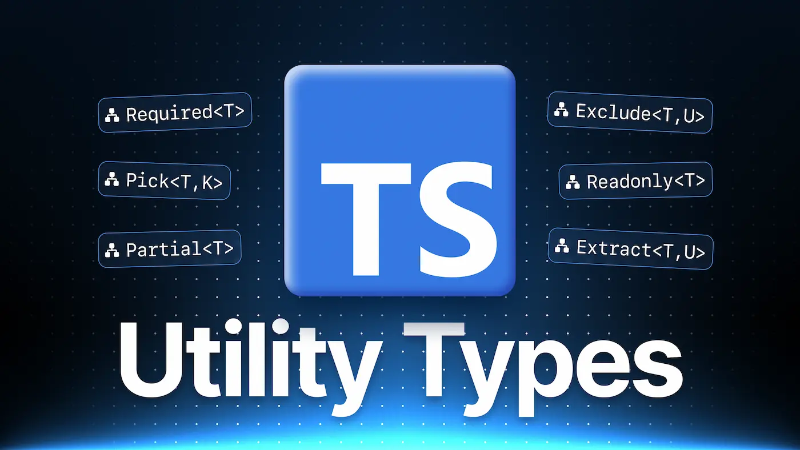

# Curso: Utility Types en TypeScript - Midudev Academy

📌 **Este repositorio contiene los materiales del curso "Utility Types en TypeScript" de la Academia Midudev.**

## 📖 Descripción

Curso práctico para aprender a usar los **Utility Types** de TypeScript.  
Descubre cómo transformar y reutilizar tipos para escribir un código más limpio, seguro y fácil de mantener.

---

## 🚀 Temario

- Configuración inicial de TypeScript
- `Partial<T>` para actualizaciones parciales de objetos
- `Required<T>` para hacer propiedades obligatorias
- `Omit<T, K>` y `Pick<T, K>` para manipular propiedades
- `Readonly<T>` para crear tipos inmutables
- `Exclude<T, U>` y `Extract<T, U>` para filtrar tipos de unión
- `ReturnType<T>` y `Parameters<T>` para trabajar con funciones
- `NonNullable<T>` para eliminar `null` y `undefined`
- `Awaited<T>` para manejar tipos de promesas
- Casos prácticos y mejores prácticas

---

## 📚 Contenido del curso

- Introducción a Utility Types
- Configuración Inicial en TypeScript
- ¡Practica lo aprendido!
- Actualiza Objetos Parcialmente
- Haciendo Propiedades Obligatorias
- Omite Propiedades en TypeScript
- Selecciona Propiedades con Pick
- Propiedades Inmutables con Readonly
- ¡Practica lo aprendido!
- Exclusión de Tipos
- Extracción de Tipos en TypeScript
- Tipos de Retorno en TypeScript
- Tipos de Parámetros
- Tipos Non Nullable
- Desenvolviendo Promesas en TypeScript

---
