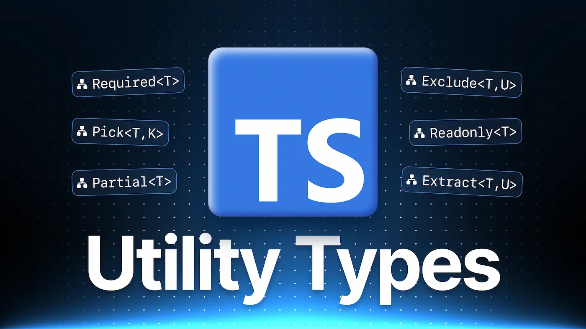

# Course: Utility Types in TypeScript - Midudev Academy

📌 **This repository contains the materials for the "Utility Types in TypeScript" course from Midudev Academy.**

## 📖 Description

A practical course to learn how to use **TypeScript Utility Types**.  
Discover how to transform and reuse types to write cleaner, safer, and more maintainable code.

---

## 🚀 Topics

- Initial TypeScript setup
- `Partial<T>` for partial object updates
- `Required<T>` to make properties mandatory
- `Omit<T, K>` and `Pick<T, K>` to manipulate properties
- `Readonly<T>` to create immutable types
- `Exclude<T, U>` and `Extract<T, U>` to filter union types
- `ReturnType<T>` and `Parameters<T>` to work with functions
- `NonNullable<T>` to remove `null` and `undefined`
- `Awaited<T>` to handle promise types
- Practical use cases and best practices

---

## 📚 Course Content

- Introduction to Utility Types
- Initial Setup in TypeScript
- Practice What You’ve Learned!
- Update Objects Partially
- Making Properties Required
- Omit Properties in TypeScript
- Select Properties with Pick
- Immutable Properties with Readonly
- Practice What You’ve Learned!
- Type Exclusion
- Type Extraction in TypeScript
- Return Types in TypeScript
- Parameter Types
- Non-Nullable Types
- Unwrapping Promises in TypeScript

---
